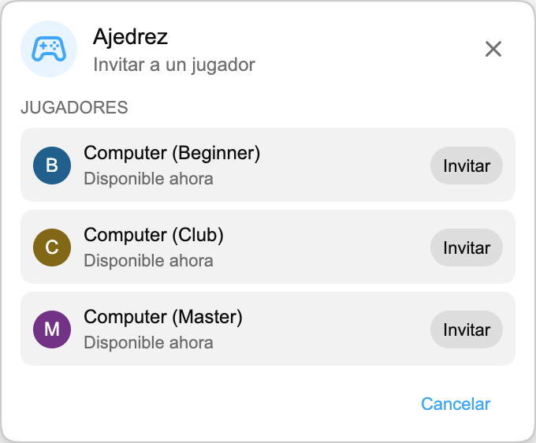

Ya puedes jugar a los juegos de Playground contra **Computer** cuando no haya otro espectador disponible.

## Cómo funciona

Abre el panel de Juegos, elige un juego e invita a un jugador Computer desde la lista.

Los rivales Computer están disponibles en todos los juegos de Playground:

- **Ajedrez**, con **Computer (Beginner)**, **Computer (Club)** y **Computer (Master)** para elegir entre tres niveles de dificultad.
- **HELP-A-FRIEND! Trivia, The Wild Wild Chat y Stick Around!**, para que todos los juegos puedan seguir jugándose cuando nadie más esté disponible.

## Cómo juega Computer

En Ajedrez, Computer espera un momento antes de mover. Beginner es el rival más sencillo, Club ofrece un nivel intermedio y Master es el más exigente.

En *HELP-A-FRIEND! Trivia*, Computer responde en cada ronda y no siempre acierta. En *The Wild Wild Chat*, observa los mensajes que coinciden con una recompensa abierta e intenta reclamarlos antes que tú. En *Stick Around!*, se mueve por la arena, esquiva las burbujas de chat que caen y lucha por ser el último jugador en pie.

## ¿Por qué añadirlo?

Computer mantiene Playground disponible en directos tranquilos, reproducciones o cualquier momento en que otro usuario de Chat Enhancer no pueda jugar.

:::media-left

Playground sigue siendo opcional. Activa **Unirse a Playground** desde los ajustes de la extensión, abre el panel de Juegos en el chat e invita a un rival Computer cuando quieras una partida.

:::
