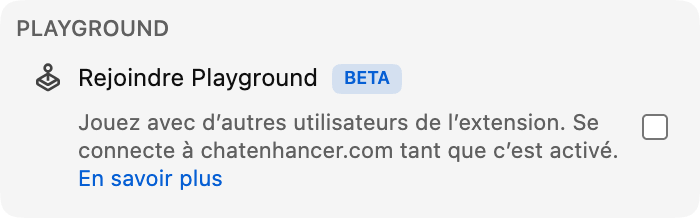

Playground se lance encore plus facilement : vous pouvez jouer contre **Computer**.

## Comment ça marche

Ouvrez Playground depuis le panneau Jeux et cherchez un joueur Computer dans la liste des joueurs. Invitez-le comme vous inviteriez un autre spectateur. La partie démarre automatiquement, et le reste de Playground fonctionne comme d’habitude.

Les adversaires Computer sont disponibles dans chaque jeu Playground :

- **Échecs**, avec **Computer (Beginner)**, **Computer (Club)** et **Computer (Master)** pour choisir une partie plus légère, intermédiaire ou plus relevée.
- **HELP-A-FRIEND! Trivia, The Wild Wild Chat et Stick Around!**, afin que chaque jeu reste accessible quand personne d’autre n’est disponible.

## Comment joue Computer

Dans Échecs, Computer attend brièvement avant de jouer, pour que la partie ne paraisse pas instantanée. Échecs propose maintenant trois adversaires Computer. Beginner est l’option la plus simple pour s’échauffer, Club joue une partie intermédiaire plus régulière, et Master est le choix le plus corsé.

Dans *HELP-A-FRIEND! Trivia*, Computer répond pendant chaque manche et ne donne pas toujours la bonne réponse. Dans *The Wild Wild Chat*, il surveille les messages correspondant à une prime ouverte et tente de les réclamer avant vous. Dans *Stick Around!*, il se déplace dans l’arène, esquive les bulles qui tombent et se bat pour rester le dernier joueur debout.

## Pourquoi l’ajouter ?

Playground est plus amusant quand quelqu’un est là pour jouer avec vous, mais le chat en direct est imprévisible. Computer garde les jeux accessibles pendant les moments plus calmes, les streams tardifs, les replays ou les petites communautés où aucun autre utilisateur de Chat Enhancer n’est forcément disponible.

:::media-left

Playground reste facultatif. Activez **Rejoindre Playground** dans les réglages de l’extension, ouvrez le panneau Jeux dans le chat et invitez un adversaire Computer quand vous voulez lancer une partie.

:::
