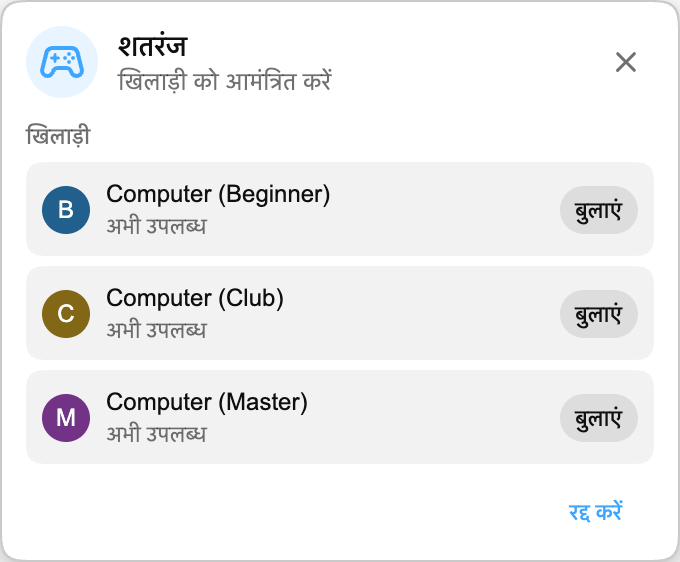

अब Playground में खेल शुरू करना और आसान है: आप **Computer** के खिलाफ खेल सकते हैं।

## यह कैसे काम करता है

गेम पैनल से Playground खोलें और player list में Computer player ढूँढ़ें। उसे वैसे ही invite करें जैसे आप किसी दूसरे viewer को invite करते हैं। Match अपने-आप शुरू हो जाता है, और Playground का बाकी अनुभव वैसा ही रहता है।

Computer प्रतिद्वंद्वी हर Playground गेम में उपलब्ध हैं:

- **शतरंज**, जिसमें **Computer (Beginner)**, **Computer (Club)** और **Computer (Master)** मिलते हैं, ताकि आप हल्का, बीच का या ज़्यादा मुश्किल match चुन सकें।
- **HELP-A-FRIEND! Trivia, The Wild Wild Chat और Stick Around!**, ताकि कोई और उपलब्ध न होने पर भी हर गेम खेला जा सके।

## Computer कैसे खेलता है

शतरंज में Computer थोड़े pause के बाद move करता है, ताकि game बहुत instant न लगे। शतरंज में अब तीन Computer opponents हैं। Beginner warm up करने के लिए सबसे आसान है, Club ज्यादा steady middle-level game खेलता है, और Master सबसे मुश्किल option है।

*HELP-A-FRIEND! Trivia* में Computer हर प्रश्न राउंड में उत्तर देता है और हमेशा सही नहीं होता। *The Wild Wild Chat* में वह खुले इनाम से मेल खाने वाले संदेश देखता है और आपसे पहले उन पर दावा करने की कोशिश करता है। *Stick Around!* में वह एरीना में चलता है, गिरते चैट बबल से बचता है और आख़िरी खिलाड़ी बने रहने के लिए लड़ता है।

## इसे क्यों जोड़ा गया?

Playground सबसे मजेदार तब होता है जब खेलने के लिए कोई और मौजूद हो, लेकिन live chat भरोसेमंद समय-सारणी पर नहीं चलता। Computer धीमे पलों, late-night streams, replays और छोटी communities में games को playable रखता है, जहाँ कोई दूसरा Chat Enhancer user हमेशा available नहीं होता।

:::media-left

Playground अभी भी opt-in है। Extension settings से **Playground से जुड़ें** enable करें, chat में गेम पैनल खोलें, और match खेलना हो तो किसी Computer opponent को invite करें।

:::
