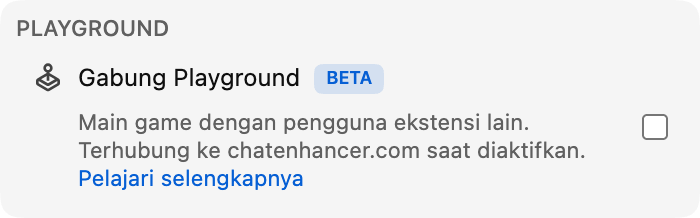

Sekarang Playground lebih mudah langsung dimainkan: Anda bisa bermain melawan **Computer**.

## Cara kerjanya

Buka Playground dari panel Game dan cari pemain Computer di daftar pemain. Undang salah satunya seperti Anda mengundang penonton lain. Pertandingan dimulai otomatis, dan bagian lain Playground tetap bekerja seperti biasa.

Lawan Computer tersedia di setiap game Playground:

- **Catur**, dengan **Computer (Beginner)**, **Computer (Club)**, dan **Computer (Master)** agar Anda bisa memilih pertandingan yang ringan, menengah, atau lebih menantang.
- **HELP-A-FRIEND! Trivia, The Wild Wild Chat, dan Stick Around!**, sehingga semua game tetap dapat dimainkan saat tidak ada orang lain.

## Cara Computer bermain

Di Catur, Computer bergerak setelah jeda singkat agar game tidak terasa terlalu instan. Catur kini memiliki tiga lawan Computer. Beginner cocok untuk pemanasan, Club bermain lebih stabil di level menengah, dan Master adalah pilihan tersulit.

Di *HELP-A-FRIEND! Trivia*, Computer menjawab setiap ronde pertanyaan dan tidak selalu benar. Di *The Wild Wild Chat*, ia mengawasi pesan yang cocok dengan hadiah terbuka dan mencoba mengklaimnya sebelum kamu. Di *Stick Around!*, ia bergerak di arena, menghindari gelembung chat yang jatuh, dan bertarung agar menjadi pemain terakhir.

## Kenapa ditambahkan?

Playground paling seru saat ada orang lain untuk diajak bermain, tetapi live chat tidak selalu bisa diprediksi. Computer menjaga game tetap bisa dimainkan di momen yang lebih sepi, stream larut malam, replay, atau komunitas kecil yang mungkin tidak selalu punya pengguna Chat Enhancer lain yang tersedia.

:::media-left

Playground tetap opt-in. Aktifkan **Gabung Playground** dari pengaturan ekstensi, buka panel Game di chat, dan undang lawan Computer saat Anda ingin bermain.

:::
