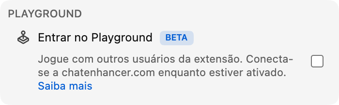

Agora ficou mais fácil entrar no Playground: você pode jogar contra **Computer**.

## Como funciona

Abra o Playground pelo painel Jogos e procure um jogador Computer na lista de jogadores. Convide-o da mesma forma que convidaria outro espectador. A partida começa automaticamente, e o restante do Playground funciona como sempre.

Os oponentes Computer estão disponíveis em todos os jogos do Playground:

- **Xadrez**, com **Computer (Beginner)**, **Computer (Club)** e **Computer (Master)**, para escolher uma partida mais leve, intermediária ou mais difícil.
- **HELP-A-FRIEND! Trivia, The Wild Wild Chat e Stick Around!**, para que todos os jogos continuem disponíveis quando ninguém mais puder jogar.

## Como o Computer joga

No Xadrez, Computer espera um pouco antes de jogar, para que a partida não pareça instantânea. Xadrez agora tem três oponentes Computer. Beginner é a opção mais fácil para aquecer, Club joga em um nível intermediário mais estável e Master é a escolha mais difícil.

No *HELP-A-FRIEND! Trivia*, o Computer responde em cada rodada e nem sempre acerta. No *The Wild Wild Chat*, ele observa mensagens que correspondem a uma recompensa aberta e tenta reivindicá-las antes de você. No *Stick Around!*, ele se move pela arena, desvia das bolhas de chat que caem e luta para ser o último jogador de pé.

## Por que adicionar isso?

O Playground é mais divertido quando há alguém por perto para jogar, mas o chat ao vivo é imprevisível. Computer mantém os jogos disponíveis em momentos mais calmos, streams tarde da noite, replays ou comunidades pequenas em que nem sempre há outro usuário do Chat Enhancer disponível.

:::media-left

O Playground continua sendo opcional. Ative **Entrar no Playground** nas configurações da extensão, abra o painel Jogos no chat e convide um oponente Computer quando quiser uma partida.

:::
