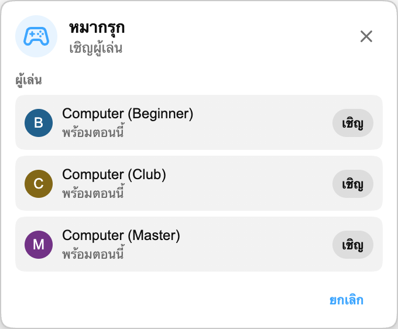

ตอนนี้เริ่มเล่น Playground ได้ง่ายขึ้นแล้ว: คุณสามารถเล่นกับ **Computer** ได้

## วิธีใช้งาน

เปิด Playground จากแผงเกม แล้วมองหาผู้เล่น Computer ในรายชื่อผู้เล่น เชิญคนใดคนหนึ่งเหมือนกับที่คุณเชิญผู้ชมคนอื่น แมตช์จะเริ่มโดยอัตโนมัติ และส่วนอื่นของ Playground ก็ทำงานเหมือนเดิม

คู่แข่ง Computer พร้อมเล่นในทุกเกมของ Playground:

- **หมากรุก** พร้อม **Computer (Beginner)**, **Computer (Club)** และ **Computer (Master)** เพื่อให้คุณเลือกแมตช์ที่เบา ระดับกลาง หรือท้าทายขึ้น
- **HELP-A-FRIEND! Trivia, The Wild Wild Chat และ Stick Around!** เพื่อให้ทุกเกมยังเล่นได้เมื่อไม่มีใครว่าง

## Computer เล่นอย่างไร

ในหมากรุก, Computer จะเดินหลังจากหยุดสั้น ๆ เพื่อให้เกมไม่รู้สึกทันทีเกินไป ตอนนี้หมากรุก มีคู่แข่ง Computer สามระดับ Beginner เหมาะสำหรับวอร์มอัป, Club เล่นนิ่งกว่าในระดับกลาง และ Master เป็นตัวเลือกที่ยากที่สุด

ใน *HELP-A-FRIEND! Trivia* Computer จะตอบในแต่ละรอบคำถามและไม่ได้ตอบถูกเสมอไป ใน *The Wild Wild Chat* จะคอยดูข้อความที่ตรงกับรางวัลที่เปิดอยู่และพยายามยึดก่อนคุณ ส่วนใน *Stick Around!* จะเคลื่อนที่ในสนาม หลบฟองแชทที่ตกลงมา และต่อสู้เพื่อเป็นผู้เล่นคนสุดท้าย

## ทำไมถึงเพิ่มสิ่งนี้?

Playground สนุกที่สุดเมื่อมีคนเล่นด้วย แต่แชทสดคาดเดาไม่ได้เสมอ Computer ช่วยให้เกมยังเล่นได้ในช่วงที่เงียบกว่า สตรีมดึก วิดีโอเล่นซ้ำ หรือชุมชนเล็ก ๆ ที่อาจไม่มีผู้ใช้ Chat Enhancer คนอื่นพร้อมเล่นตลอดเวลา

:::media-left

Playground ยังคงเป็นตัวเลือกที่ต้องเปิดเอง เปิด **เข้าร่วม Playground** จากการตั้งค่าส่วนขยาย เปิดแผงเกมในแชท แล้วเชิญคู่แข่ง Computer เมื่อคุณอยากเริ่มแมตช์

:::
