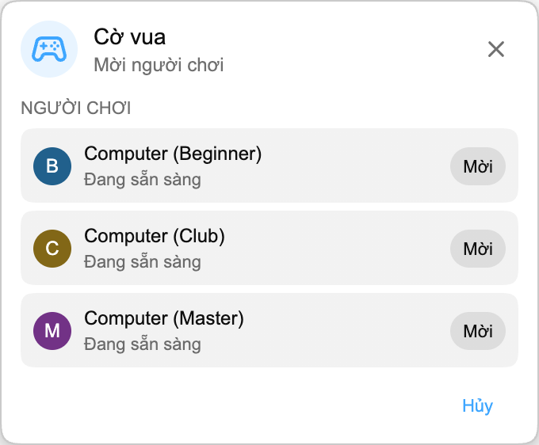

Giờ đây Playground dễ bắt đầu hơn: bạn có thể chơi với **Computer**.

## Cách hoạt động

Mở Playground từ bảng Trò chơi và tìm một người chơi Computer trong danh sách người chơi. Mời một trong số đó giống như cách bạn mời một người xem khác. Trận đấu sẽ tự động bắt đầu, và phần còn lại của Playground vẫn hoạt động như thường lệ.

Đối thủ Computer có trong mọi trò chơi Playground:

- **Cờ vua**, với **Computer (Beginner)**, **Computer (Club)** và **Computer (Master)** để bạn chọn trận nhẹ, trung bình hoặc thử thách hơn.
- **HELP-A-FRIEND! Trivia, The Wild Wild Chat và Stick Around!**, để mọi trò chơi vẫn chơi được khi không có ai khác.

## Computer chơi như thế nào

Trong Cờ vua, Computer đi sau một khoảng dừng ngắn để ván đấu không có cảm giác diễn ra quá tức thì. Cờ vua hiện có ba đối thủ Computer. Beginner phù hợp để khởi động, Club chơi ổn định hơn ở mức trung bình, còn Master là lựa chọn khó nhất.

Trong *HELP-A-FRIEND! Trivia*, Computer trả lời ở mỗi vòng câu hỏi và không phải lúc nào cũng đúng. Trong *The Wild Wild Chat*, nó theo dõi các tin nhắn khớp với tiền thưởng đang mở và cố nhận trước bạn. Trong *Stick Around!*, nó di chuyển trong đấu trường, né các bong bóng chat rơi xuống và chiến đấu để trở thành người chơi cuối cùng.

## Vì sao thêm tính năng này?

Playground vui nhất khi có ai đó để chơi cùng, nhưng live chat không phải lúc nào cũng đoán trước được. Computer giúp các game vẫn chơi được trong những lúc yên tĩnh hơn, stream đêm muộn, replay hoặc cộng đồng nhỏ nơi không phải lúc nào cũng có người dùng Chat Enhancer khác sẵn sàng.

:::media-left

Playground vẫn là tính năng opt-in. Bật **Tham gia Playground** trong cài đặt tiện ích, mở bảng Trò chơi trong chat và mời một đối thủ Computer khi bạn muốn chơi một trận.

:::
